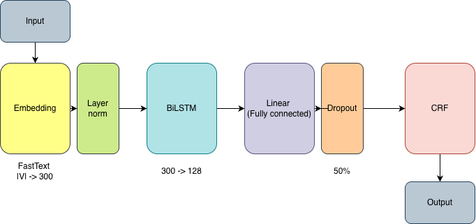
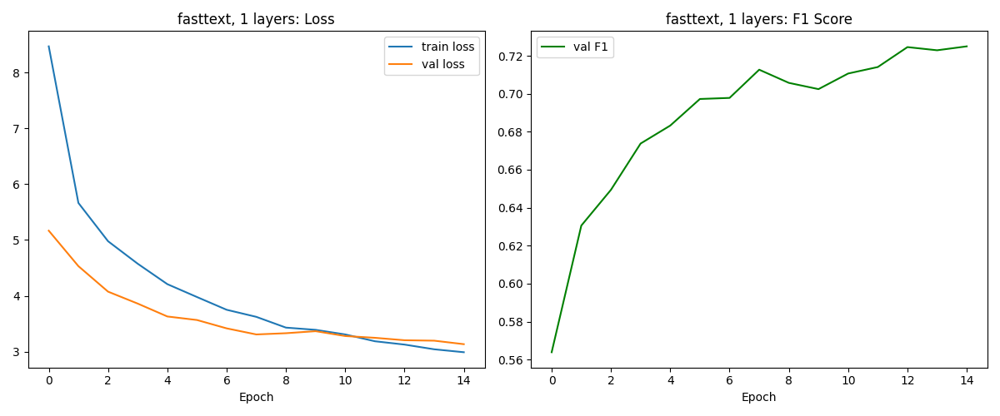
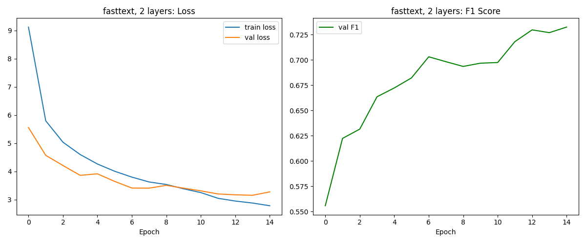
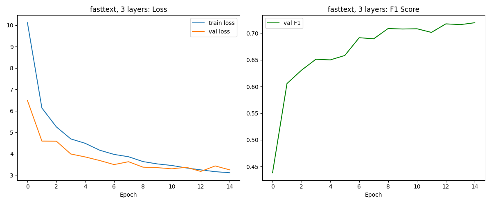

# Q2. NER with BiLSTM-CRF

Named Entity Recognition using a BiLSTM-CRF model with FastText embeddings and an ablation study over LSTM depth.

---

## Model Architecture



The layer-wise model architecture is shown below:

| Component | Details |
|---|---|
| Embedding | FastText (300d), frozen |
| LayerNorm | Applied post-embedding for gradient stability |
| BiLSTM | 1–3 layers, hidden dim 128, dropout 0.5 |
| FC | Maps BiLSTM output to tag emissions |
| CRF | Decodes globally-optimal label sequences |

Weights are initialized with xavier (input-hidden), orthogonal (hidden-hidden), and forget-gate bias is set to 1.

---

## Data Preprocessing

- Tokens lowercased; vocabulary built with `min_freq=2` to reduce noise
- Special tokens: `<PAD>` (idx 0), `<UNK>` (idx 1)
- Labels use `<PAD>` = 0; BIO tags indexed from 1
- Sequences padded per-batch; CRF mask derived from non-pad positions
- FastText coverage printed at load time; falls back to random init if file is missing

---

## Loss Plots

Training/validation loss and val F1 per experiment are saved to `plots/`:







Each plot has two subplots: **Loss** (train + val) and **F1** over epochs.

---

## Run Instructions

**Prerequisites:** place `wiki-news-300d-1M-subword.vec` in `../` and dataset files in `../dataset/`.

```bash
# ablation study (trains L=1,2,3; saves to best_model.pt)
python q2.py --mode ablate

# inference on test_data.jsonl using best_model.pt
python q2.py --mode test
```

Output predictions are written to `tagged_output.jsonl`.

**Key hyperparameters** (see `Config`): hidden=128, batch=16, lr=0.0015, dropout=0.5, epochs=15, early-stop patience=7.
